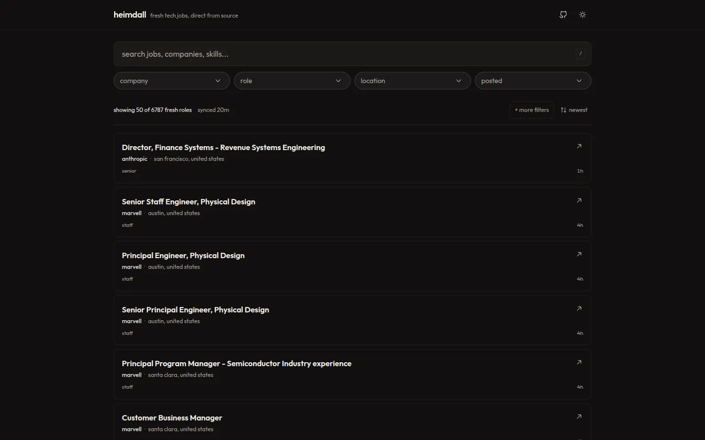

# Heimdall

[](LICENSE)
[](https://github.com/swarooppatilx/heimdall/actions/workflows/ci.yml)

A search engine for fresh, verified tech jobs. Every listing is pulled straight from an official company career page or its ATS provider, never re-posted from a job board.

Try the live instance: <https://heimdall.daenerys.workers.dev>



## Why not a job board?

Job boards resell and repost listings, so dates drift, duplicates pile up, and postings that were filled months ago still rank first. Heimdall reads from the same Greenhouse, Lever, Ashby, Workable, and SmartRecruiters feeds that job boards copy. A listing here is what the company posted, on the day it posted it, or it is not here at all.

## Tech stack

| Layer | Technology |
| --- | --- |
| Frontend | Next.js, React, TypeScript, Tailwind CSS, shadcn/ui, TanStack Query |
| Backend | Cloudflare Workers (OpenNext) |
| Data | Drizzle ORM, Cloudflare D1 |
| Caching | Cloudflare KV |
| Scheduling | Workers Cron
| CI | GitHub Actions: typecheck, lint, knip, tests, build |

## Deploy & self-host

Heimdall runs on Cloudflare Workers. To deploy to your own account:

1. Login: `npx wrangler login`
2. Create the D1 database. Wrangler writes the binding into `wrangler.jsonc` for you:
   `npx wrangler d1 create heimdall --binding DB --update-config`
3. Create the KV namespace (same auto-config):
   `npx wrangler kv namespace create heimdall-cache --binding CACHE --update-config`
4. Swap the Web Analytics token in `wrangler.jsonc` for your own, if you have one.
5. Deploy: applies the migrations to the remote database, builds the worker, and deploys in one command.

   ```bash
   npm run deploy
   ```

6. The first scheduled crawl runs within 30 minutes and populates the database. The Analytics Engine dataset (`heimdall`) auto-creates on the first write, so there is no provisioning step.
7. To enable on-demand crawls in production, set the trigger secret: `npx wrangler secret put CRAWL_TRIGGER_TOKEN`. Skip it for a crawler that only runs on the cron.

The full variable, secret, and binding reference is in [CONTRIBUTING.md](CONTRIBUTING.md).


## Contributing

Contributions welcome. See [CONTRIBUTING.md](CONTRIBUTING.md).

## Security

Found a vulnerability? Report it privately via GitHub's private vulnerability reporting instead of opening a public issue.

## License

Heimdall is licensed under the [GNU Affero General Public License v3.0](LICENSE).